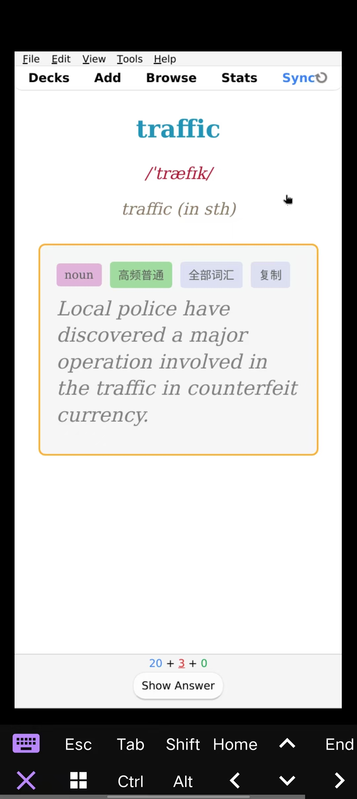
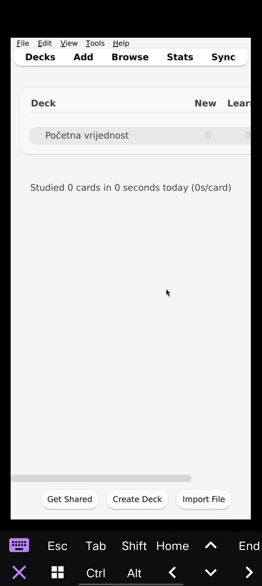

# Termux Anki

在 Android 上通过 Termux、Debian proot 和本地 VNC 会话运行桌面版 Anki。

这个方案主要面向手机触控场景。Termux:X11 的画质和延迟更好，但桌面 Anki 的小按钮和菜单在手机上不太好点；VNC 客户端，尤其是 AVNC 的触控板模式、缩放和手势更适合手指操作。

灵感来源于 Anki Discord 讨论：

https://discord.com/channels/368267295601983490/1216428695481487460

英文版本：[README.md](README.md)

## 截图





## 需求

- ARM64 Android 设备
- Termux
- 几 GB 可用空间
- 首次安装建议使用 Wi-Fi
- Android VNC 客户端，推荐 AVNC

## 安装

从 GitHub 一行命令下载安装：

```bash
pkg install -y wget && wget -O install-termux-anki-vnc.sh https://raw.githubusercontent.com/zitons/termux-anki/main/install-termux-anki-vnc.sh && bash install-termux-anki-vnc.sh
```

把仓库复制到 Termux 后运行：

```bash
bash install-termux-anki-vnc.sh
```

安装脚本可以重复运行。它会检查已经完成的步骤，并继续补齐缺失部分。

只检查当前进度：

```bash
bash install-termux-anki-vnc.sh --check
```

## 启动

启动 VNC 版 Anki：

```bash
~/start-anki-vnc.sh
```

使用 Anki 时保持这个 Termux 会话打开。VNC server 会以前台方式运行，避免 proot 会话退出后把 VNC 进程一起结束。

然后在 AVNC/bVNC 里连接：

```text
Host: 127.0.0.1
Port: 5901
Username: 留空
Password: ankianki
```

如果 VNC 客户端只有一个地址输入框，填：

```text
127.0.0.1:5901
```

## 显示调节

默认配置偏向手机竖屏：

```text
VNC_GEOMETRY=anki
ANKI_SCALE=1.5
ANKI_FONT_DPI=144
ANKI_WINDOW_SIZE=phone
```

`ANKI_WINDOW_SIZE=phone` 会读取 Android 的 `wm size`，等 Anki 启动后把 Anki 窗口调整到这个尺寸。默认 `VNC_GEOMETRY=anki` 时，VNC 桌面也会使用同一个手机尺寸。如果读取不到 `wm size`，会回退到 `600x1200`。

启动时可以覆盖这些参数：

```bash
VNC_GEOMETRY=auto ~/start-anki-vnc.sh
```

`auto` 会直接使用 Android `wm size` 输出的原始分辨率。例如 Android 返回 `1080x2400`，VNC 桌面就使用 `1080x2400`。如果读取不到，会回退到 `600x1200`。

也可以指定固定尺寸：

```bash
VNC_GEOMETRY=720x1280 ANKI_SCALE=1.25 ~/start-anki-vnc.sh
```

界面还嫌小：

```bash
VNC_GEOMETRY=854x1080 ANKI_SCALE=1.5 ~/start-anki-vnc.sh
```

想要更多横向空间：

```bash
VNC_GEOMETRY=1200x1080 ANKI_SCALE=1.25 ~/start-anki-vnc.sh
```

AVNC 里建议使用 touchpad/trackpad 模式。桌面 Anki 本身不是原生触控 UI，用手指模拟鼠标通常比直接触控更顺手。

## 可配置项

安装或启动时可以设置：

```bash
ANKI_USER=anki
ANKI_PRE=0
DISTRO=debian
VNC_DISPLAY=:1
VNC_GEOMETRY=anki
VNC_START_GEOMETRY=1280x960
VNC_DEPTH=24
VNC_LOCALHOST=no
VNC_PASSWORD=ankianki
ANKI_SCALE=1.5
ANKI_FONT_DPI=144
ANKI_WINDOW_SIZE=phone
```

安装 Anki beta/pre-release：

```bash
ANKI_PRE=1 bash install-termux-anki-vnc.sh
```

自定义 VNC 密码：

```bash
VNC_PASSWORD=yourpass bash install-termux-anki-vnc.sh
```

VNC 密码至少需要 6 个字符。

## 停止

停止 VNC server：

```bash
proot-distro login debian --user anki -- vncserver -kill :1
```

## 排查

检查 Termux 是否能连到 VNC 端口：

```bash
timeout 3 bash -c 'head -c 12 < /dev/tcp/127.0.0.1/5901'
```

正常输出应以这个开头：

```text
RFB
```

如果出现 `Connection refused`，说明 VNC server 没有运行。

查看 Anki 日志：

```bash
proot-distro login debian --user anki --shared-tmp -- tail -n 80 /tmp/anki-vnc.log
```

如果 VNC 报错说不能把 `~/.vnc` 迁移到 `~/.config/tigervnc`，重新运行安装脚本即可。脚本会使用新的 TigerVNC 配置目录，并备份旧的 `~/.vnc`。

## 说明

安装脚本包含这些 Termux/proot 下运行 Anki 的 workaround：

- hold/remove `libpci3`，规避 Debian ARM64 proot 下的 segmentation fault
- 写入 `~/.local/share/Anki2/gldriver6`，内容为 `software`
- 使用 `QTWEBENGINE_CHROMIUM_FLAGS="--disable-seccomp-filter-sandbox --disable-gpu"` 启动 Anki
- 默认使用软件 OpenGL

## 贡献

欢迎 PR，尤其是更好的手机显示配置、VNC 客户端建议，以及不同设备上的兼容性修复。
